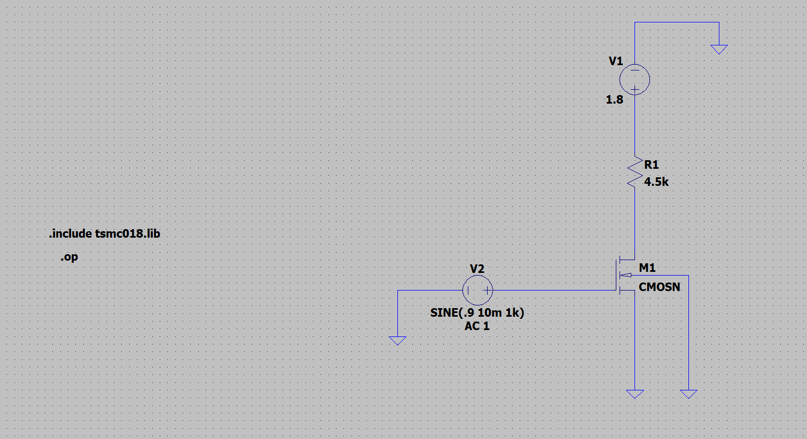
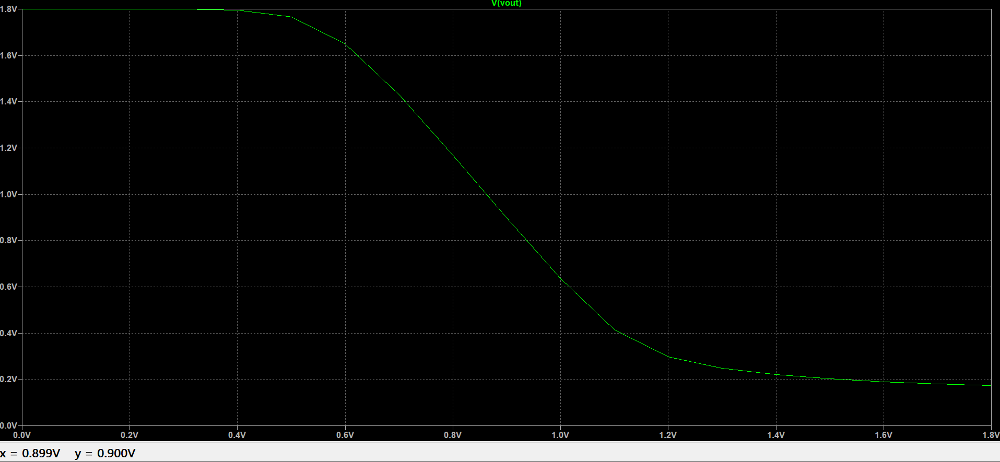
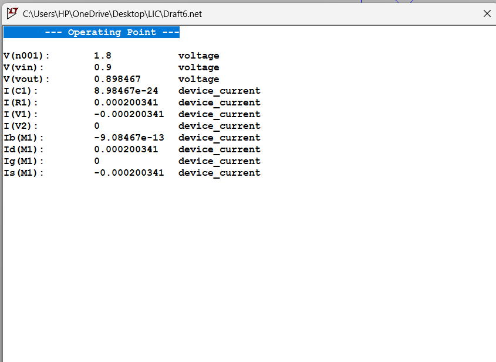
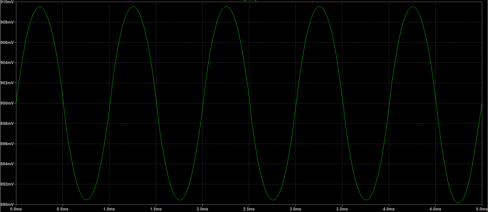
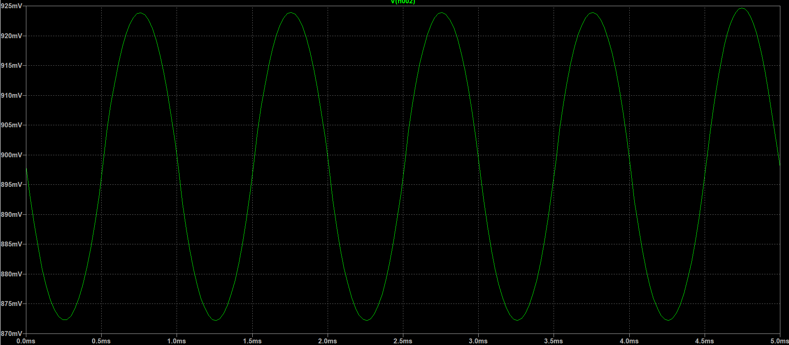
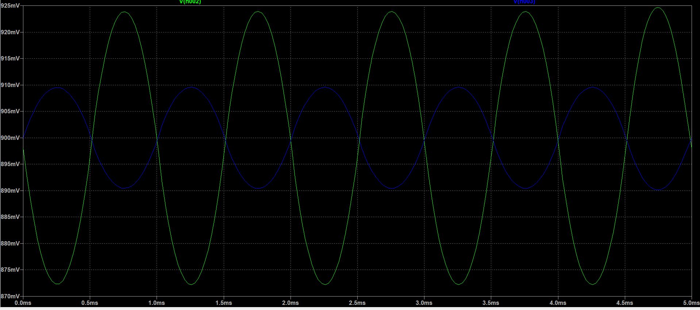
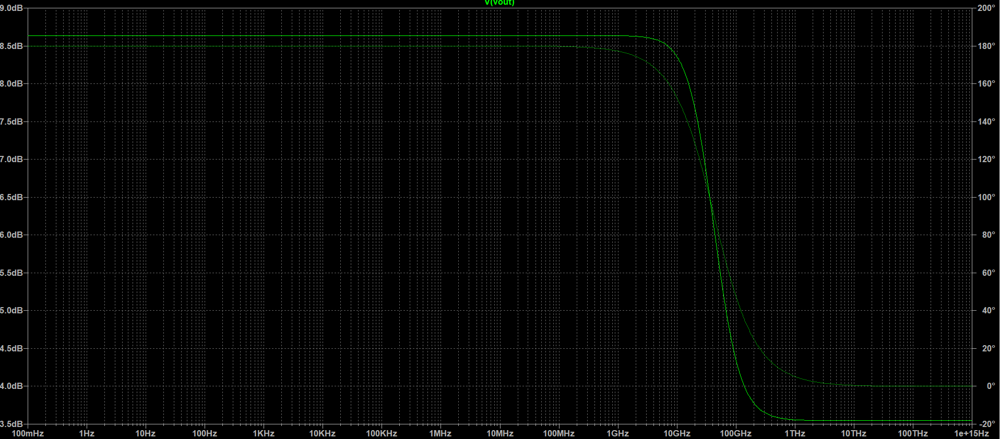
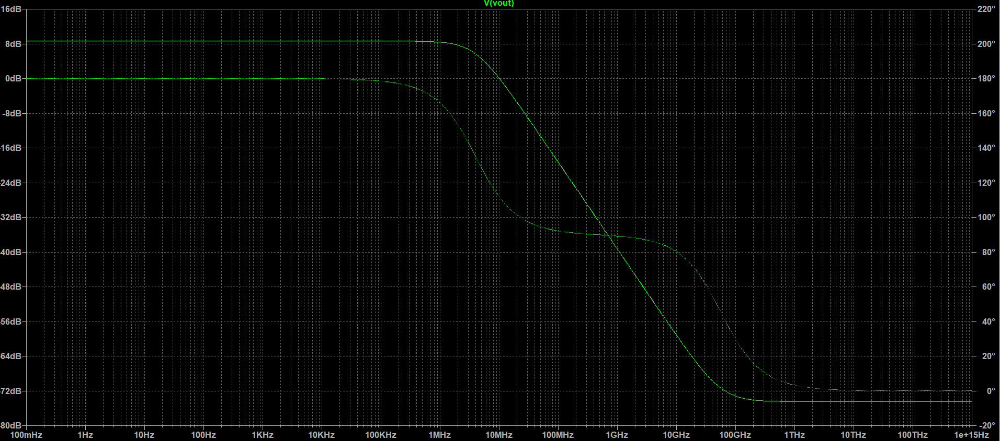

#  Linear Integrated Circuits Laboratory  

## Experiment 1: Design of Common Source Amplifier using NMOS (TSMC 180nm)

**Name:** Suhas Koushik K S  
**USN:** 4NI24EC180  
**Branch:** Electronics and Communication Engineering  
**Lab Course:** Linear Integrated Circuits (BEC456B)  
**Tool Used:** LTspice  
**Technology Library:** TSMC 180nm  
---

# Problem Statement

Q1))Design a Common Source (CS) amplifier using an NMOS transistor in TSMC 180nm technology library using LTspice with the following specifications:

- Supply voltage (VDD) = 1.8V  
- Power constraint P ≤ 1mW  
- Load capacitance CL = 10pF  
- Channel length Ln = 560nm  

Perform DC analysis, transient analysis and AC frequency response analysis and study the effect of load capacitance on gain and bandwidth.

---

# Introduction

Amplifiers are fundamental building blocks in analog integrated circuits used to increase signal strength. Among MOSFET amplifier configurations — Common Source (CS), Common Drain (CD), and Common Gate (CG) — the Common Source amplifier is most widely used for voltage amplification.

Common Source amplifier provides:

- High voltage gain  
- Moderate input impedance  
- Good output swing  
- 180° phase shift between input and output  

Compared to:

- Common Drain → unity gain (buffer)
- Common Gate → current amplifier, high-frequency applications  

CS amplifier is preferred for general analog voltage amplification.

MOSFET operates as a voltage-controlled current device. A small variation in gate voltage controls drain current which produces amplified voltage across the drain resistor.

For proper amplification MOSFET must operate in saturation:

VGS > VTH  
VDS ≥ (VGS − VTH)

In practical ICs, MOSFET contains parasitic capacitances:

- Gate–Source capacitance (Cgs)  
- Gate–Drain capacitance (Cgd)  
- Drain–Body capacitance (Cdb)  

These affect high-frequency response and reduce gain and bandwidth.

When load capacitor is connected:

- bandwidth decreases  
- gain-bandwidth tradeoff observed  

---

# Theory of CS Amplifier

Input → Gate terminal  
Output → Drain terminal  
Source → Ground  

Increase in gate voltage increases drain current.

Voltage drop across RD increases → output voltage decreases → phase inversion occurs.

Voltage gain:

Av = − gm RD  

Practical gain:

Av = − gm (RD || ro)

---

# Circuit Implementation

# Device Parameters (From Datasheet)

Threshold voltage: Vth = 0.36 V  

Oxide thickness: tox = 4.1 × 10⁻⁹ m  

Electron mobility: μn = 273.809 × 10⁻⁴ m²/Vs  

Oxide permittivity: εox = εr ε0 = 8.854 × 10⁻¹² × 3.9  
εox = 3.45 × 10⁻¹¹  

Oxide capacitance: Cox = εox / tox  
Cox = (3.45 × 10⁻¹¹) / (4.1 × 10⁻⁹)  
Cox = 8.414 mF/m²  

---

# DC Analysis

Power given:

P ≤ 1 mW  

Since:

P ≤ VDD ID  

ID ≤ P / VDD  

ID ≤ (1 × 10⁻³) / 1.8  

ID ≤ 555.555 µA  

Let us assume:

ID = 200 µA  

Power condition check:

P = ID × VDD  

P = 200µA × 1.8  

P = 0.36 mW < 1 mW  

Hence satisfied.

---

Choose midpoint bias:

Vout = VDS = VDD / 2  

Vout = 1.8 / 2 = 0.9 V  

Drain resistor:

RD = (VDD − Vout) / ID  

RD = (1.8 − 0.9) / 200µA  

RD = 4.5 kΩ  

---

# Width Calculation

Using MOSFET equation:

ID = (1/2) μn Cox (W/L) (VGS − Vth)²  

Rearranging:

W = (2 ID L) / [μn Cox (VGS − Vth)²]

Substituting values:

W ≈ 1.07 µm  

Theoretically fixed ID of 200µA corresponds to width ≈ 1.07µm.

Practically, to obtain exact ID ≈ 200µA in simulation, width adjusted to:

W ≈ 1.534 µm  

If width increases, current increases.  
If length increases, current decreases because resistance increases.

---
# DC Sweep Analysis
DC sweep shows variation of drain current with gate voltage.

Observations:
- Current starts flowing after threshold voltage.
- Drain current increases with increase in VGS.
- Saturation region identified for selected bias point.

This helps in selecting proper operating point for amplification.

DC sweep analysis was performed by varying the gate voltage (VGS) and observing the variation in drain current (ID).

Observations:

- Drain current starts flowing only after VGS exceeds threshold voltage (VTH ≈ 0.36 V).
- ID increases as VGS increases.
- Saturation region is identified where current becomes relatively stable for increasing VDS.

This analysis helps in:

- Identifying the threshold region
- Understanding device characteristics
- Selecting a proper DC bias point for amplification

The selected operating point (VGS ≈ 0.9 V, ID ≈ 200 µA) lies in the saturation region, ensuring proper amplifier operation.

# DC Operating Point

DC operating point confirms proper biasing of MOSFET.

Observations:
- Drain current ≈ 200µA
- Output voltage near mid-supply
- MOSFET operating in saturation region
This ensures linear amplification.

Observed:

ID ≈ 200 µA  
VDS ≈ 0.9 V  

Check saturation:

VGS > Vth  
VDS ≥ VGS − Vth  

Condition satisfied → MOSFET in saturation.

---

# Transient Analysis

Input:

- Sine wave  
- Frequency = 1kHz  
- Amplitude = 10mV  
- DC bias = 0.9V  

→→The input waveform is a sinusoidal signal applied at the gate with a small amplitude and DC bias.  
This represents the excitation signal given to the CS amplifier for amplification.

→→The output waveform is amplified compared to the input waveform.  
The amplitude increase confirms voltage amplification by the CS amplifier.

→→Both input and output waveforms are plotted together.

Observations:
- Output amplitude is greater than input → amplification achieved.
- Output waveform is inverted → 180° phase shift.
- DC shift present due to biasing.

This confirms proper working of Common Source amplifier.

Measured:

Vin(p-p) = 909.564 mV − 890.429 mV  
Vin(pp) = 19.135 mV  

Vout(p-p) = 924.349 mV − 872.666 mV  
Vout(p-p) = 51.683 mV  

Practical gain:

Av = Vout / Vin  

Av = 51.683 / 19.135  

Av = 2.700  

Gain in dB:

Av(dB) = 20 log(2.7)  

Av(dB) = 8.627 dB  

This is the gain obtained from transient waveform.

---

# Theoretical Gain

Theoretical gain:

Av = −gm RD  

gm = 2ID / VOV  

gm = (2 × 200µA) / (0.9 − 0.36)  

gm = 0.74 mS  

Av = 0.74 × 10⁻³ × 4.5 × 10³  

Av = 3.33  

Gain in dB:

20 log(3.33) = 10.44 dB  

This gives a higher value because it assumes ideal MOSFET.

In practical simulation:

- MOSFET output resistance (ro)  
- Channel length modulation  
- Parasitic capacitances  

reduce the gain.

Actual gain:

Av = −gm (RD || ro)

Since (RD || ro) < RD, practical gain becomes lower than ideal gmRD value.

Hence difference between theoretical and simulated gain is expected and validates real device behavior.

---

# AC Analysis

## Without Load Capacitor
High bandwidth observed due to only MOSFET parasitic capacitances affecting frequency response.

Unity gain not reached within plotted frequency range.

Reason:

- amplifier has relatively small gain (~8.63dB)
- internal parasitic capacitances create a very high cutoff frequency
- unity gain frequency lies beyond the simulated sweep range

3dB gain:

≈ 5.63dB  

Cutoff frequency:

≈ 51.65 MHz  

---

## With Load Capacitor CL = 10pF
Bandwidth reduces due to added load capacitance introducing dominant pole.

-3dB gain point:

5.63 dB → normal scale gain = 1.91  

Cutoff frequency:

≈ 4.008 MHz  

GBW₁:

= 1.91 × 4.008×10⁶  

= 7.655×10⁶ Hz  

Unity gain bandwidth:

≈ 8.81 MHz  

GBW₂:

= 1 × 8.81×10⁶  

= 8.81×10⁶ Hz  

Both GBW values are approximately equal.
The slight difference is due to non-ideal multi-pole behavior.
Load capacitor introduces dominant pole:
fp = 1 / (2π (RD || ro) CL)

Hence bandwidth reduces significantly.

Hence gain-bandwidth product verified.

---

# Effect of Parasitic Capacitances

MOSFET contains internal capacitances:

- Gate–Source capacitance (Cgs)  
- Gate–Drain capacitance (Cgd)  
- Drain–Body capacitance (Cdb)  

These:

- reduce high-frequency gain  
- reduce bandwidth  
- introduce pole in frequency response  

External CL further reduces bandwidth significantly.
# AC Analysis Justification

Without capacitor:

Only parasitic capacitances determine cutoff → high bandwidth.

With capacitor:

External CL dominates → pole shifts to lower frequency → bandwidth reduces.

Gain × Bandwidth approximately constant.

Small variation due to:

- Parasitic capacitances  
- ro effect  
- Multiple poles  

---

# Summary

- Power constraint satisfied (0.36 mW < 1 mW)
- MOSFET operates in saturation region
- Practical gain ≈ 8.63 dB
- Theoretical gain ≈ 10.44 dB
- Difference due to non-ideal MOSFET behavior
- Bandwidth without capacitor = 51.65 MHz
- Bandwidth with 10 pF = 4.008 MHz
- Gain–bandwidth tradeoff verified
---

# Inference

- Practical gain lower due to ro and parasitic effects  
- Load capacitor reduces bandwidth significantly  
- Unity gain bandwidth approximately equals 3dB gain-bandwidth product  
- Frequency behaviour matches theoretical amplifier characteristics  

---

# Conclusion

Common Source amplifier using NMOS in TSMC 180nm was successfully designed in LTspice under given constraints.

DC, transient and AC analyses were performed. Practical gain obtained from waveform matched AC analysis. Theoretical gain differed due to non-ideal effects. Gain-bandwidth trade-off and impact of load capacitance were clearly observed.

Hence, the design and analysis of CS amplifier is verified successfully.
